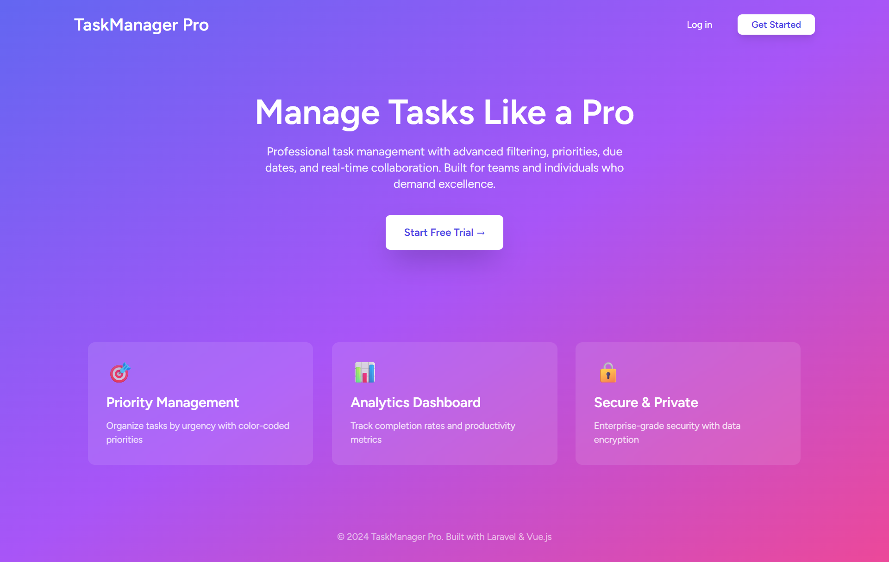
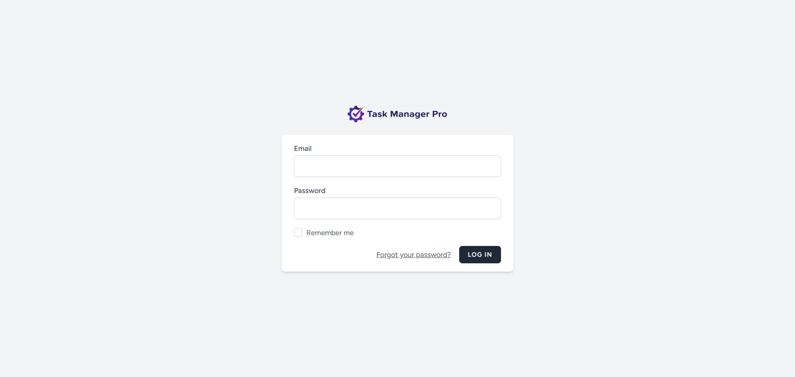
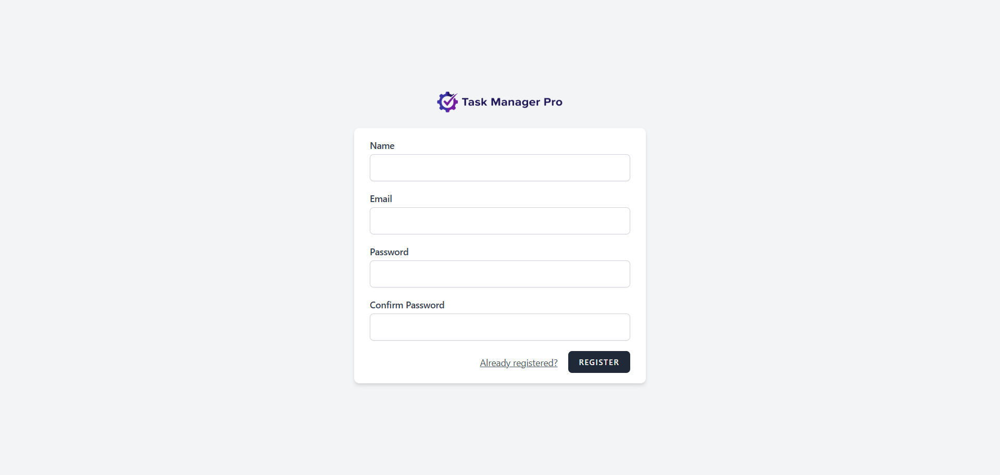
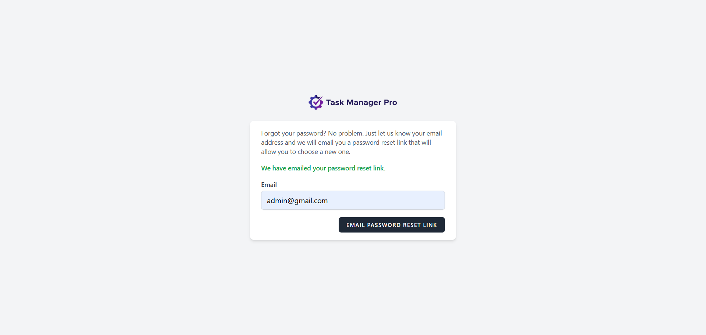
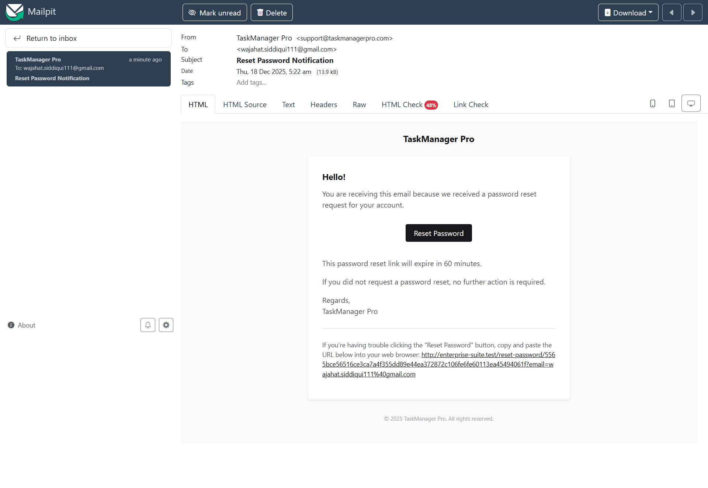
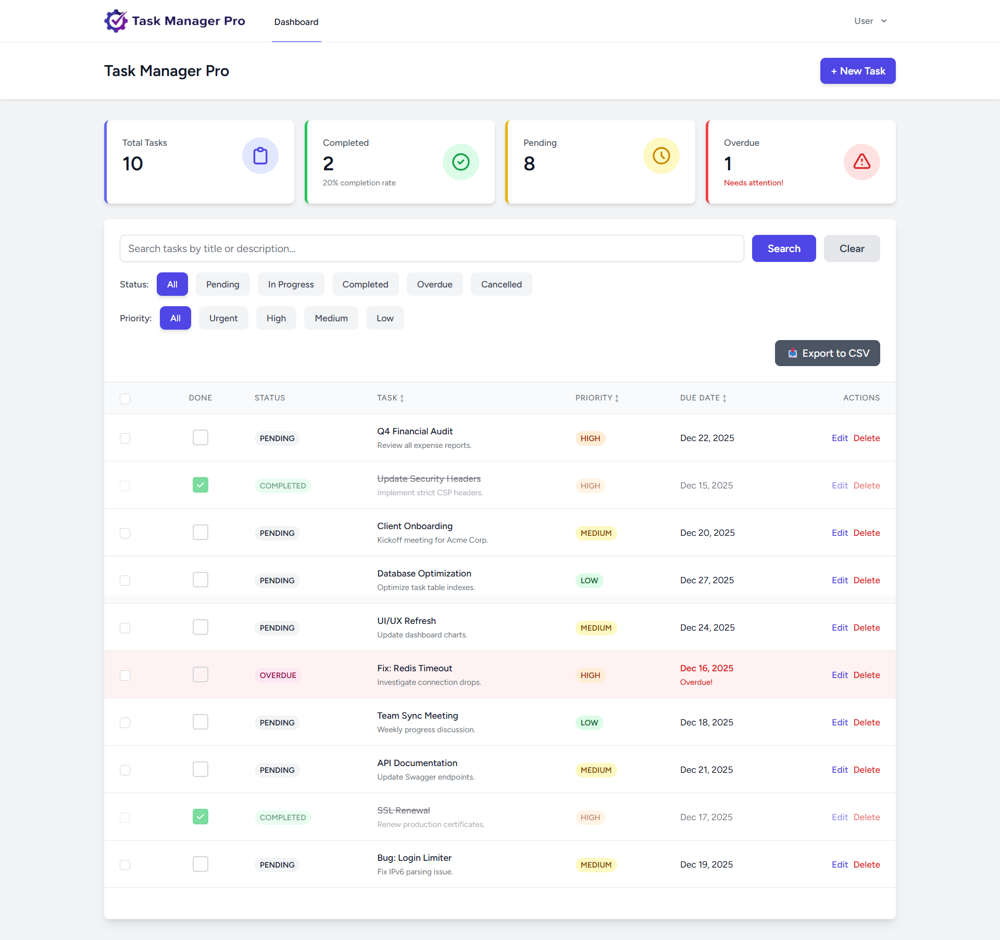
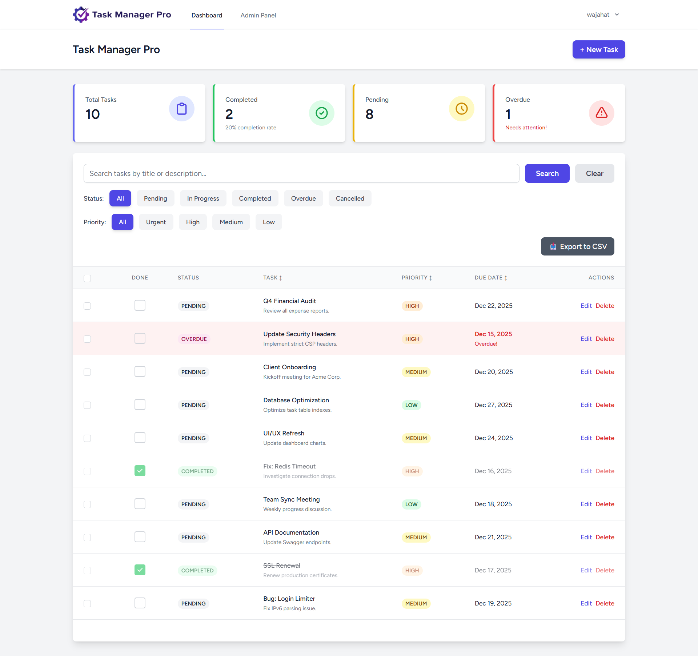
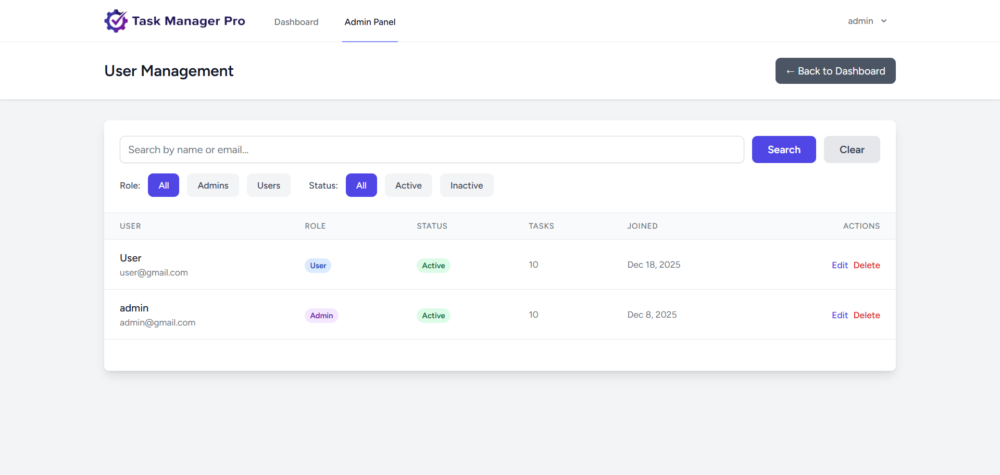
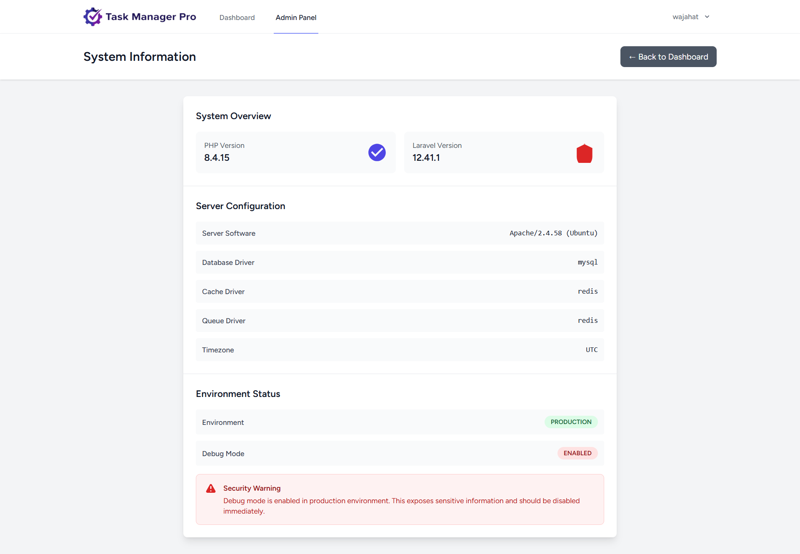

# Task Manager Pro ✅

Task Manager Pro is a modern, professional task management application built with **Laravel** and **Vue 3**.  
It helps individuals and teams stay organized, track progress, and manage tasks efficiently with a clean and responsive interface.

---

## 🌍 Live Demo

🔗 **Live App:** http://13.62.223.230/  
📧 **Demo Admin Email:** admin@gmail.com 
📧 **Demo User Email:** user@gmail.com  
🔑 **Password:** password123

---

## 📸 Screenshots

### Home


### Login Page


### Register Page


### Forgot Password Page


### Reset Password


### User Dashboard


### Admin Dashboard


### Admin Manage Users


### Admin All Tasks


### Admin System Information



---

## ✨ Features

### 🧩 Task Management
- Create, edit, and delete tasks
- Set priorities: **Low, Medium, High, Urgent**
- Track task status: **Pending, In Progress, Completed, Cancelled**
- Due dates with automatic overdue detection
- Bulk delete tasks

### 🔍 Smart Organization
- Search tasks by title or description
- Filter by priority and status
- Sort by title, priority, or due date

### 📊 Dashboard & Insights
- Task completion statistics
- Tasks grouped by priority and status
- Recent activity tracking

### 👤 User & Admin Features
- Secure authentication (Laravel Breeze)
- Admin dashboard
- User management
- Activity logs
- System information panel

### 🎨 UI & Experience
- Clean and modern interface
- Dark mode support
- Fully responsive (mobile, tablet, desktop)

---

## 🛠️ Tech Stack

### Backend
- Laravel 11
- PHP 8.2+
- MySQL
- Eloquent ORM

### Frontend
- Vue.js 3
- Inertia.js
- Tailwind CSS
- Vite

### Infrastructure
- AWS EC2
- Apache2

---

## 🚀 Installation & Setup

### Requirements
- PHP 8.2+
- Composer
- Node.js 18+
- MySQL

### Setup Steps

```bash
git clone https://github.com/yourusername/taskmanager-pro.git
cd taskmanager-pro
